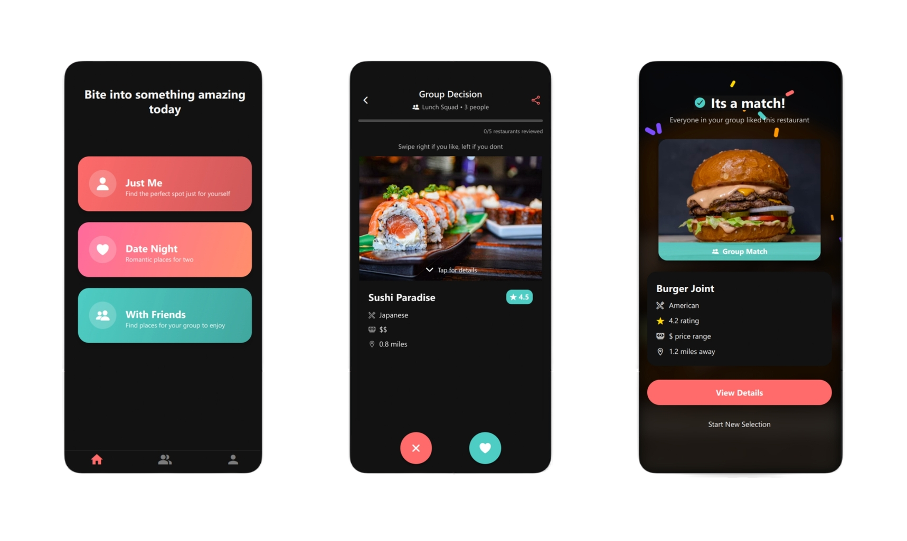
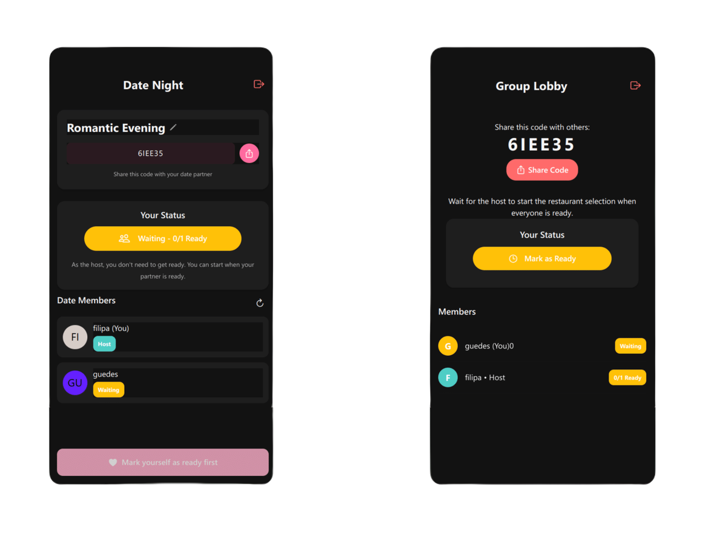
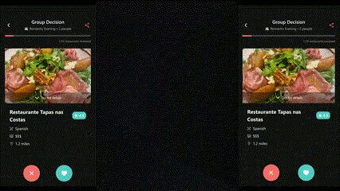

<p align="center">  </p> 

<h1 align="center">BiteFinder</h1> 

<p align="center"> <em>A Tinder-style app that helps you and your friends decide where to eat.<br> AI-driven, BiteFinder adapts suggestions to both individual and group preferences.</em> </p>

<p align="center">
  
</p>


## 📱 Features

- **Personalized Profiles**: Set the vibe and food traits you're craving - like rural, lively, spicy, or crunchy.
- **Friend Groups**: Create a “bite group” and invite friends to decide together.  
- **AI-Powered Recommendations**: Combine user preferences and local options for ideal restaurant suggestions.  
- **Group Swipe**: Tinder-like interface for exploring options until everyone agrees.  
- **Culinary Match**: When all members swipe right on the same restaurant, it’s a match!

<p align="center"> </p>  


## ⚙️ How It Works

- **Data Acquisition & Vectorization**  
Restaurants are fetched via the Google Places API → parsed to structured text with Gemini → converted into feature vectors with Mistral.  

- **Individual Profile**  
User preferences follow the same flow as restaurant data—structured by Gemini, then vectorized by Mistral into individual “ideal restaurant” vectors.  

- **Group Vector**  
Individual vectors are aggregated into a single group representation of the collective ideal.  

- **Matching & Swipe**  
The group vector is compared against our restaurant vectors; top matches are presented in a swipe interface, and when everyone swipes right on a restaurant, it’s confirmed as the group’s choice.

  <p align="center">
  
  </p>


## 🛠️ Technologies

- **Frontend**: React Native & Expo  
- **Backend**: Python with Gemini and Mistral via the OpenAI API  
- **Database**: SingleStore (cloud)  
- **External APIs**: Google Places API  


## 🚀 Installation
```bash
# Clone the repository
git clone https://github.com/Tiago5Carneiro/bitefinder

# Navigate to the directory
cd bitefinder

# Install dependencies
npm install

# Start the application
npm start
```

```bash
# Change to .env
mv .default-env .env

# Navigate to directory
cd backend

# Run back-end
python bitefinder.py

# Run web-socket server in a different terminal
python websocket_server.py
```